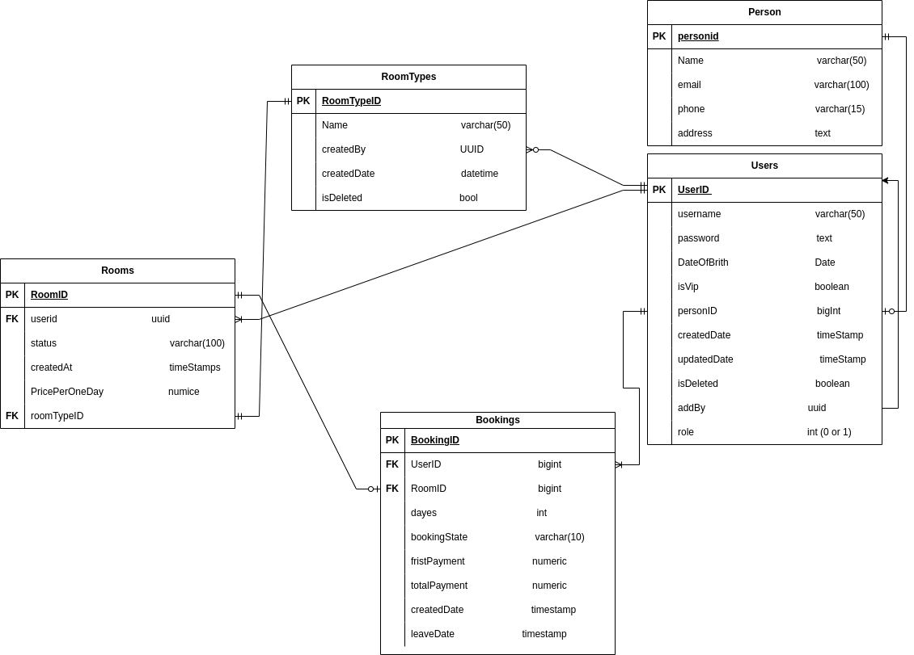

# Asp room booking Project

A modern, scalable e-commerce platform built with Asp, React, and Blueprint.

## Overview

this project is basic hotel managment system that is about creating room  make people booking it

## erd for project


## Tech Stack

- **Backend**: dotnet 9, c# 13 ,ADO.net
- **Database**: PostgreSQL
- **Frontend**: React,  Tailwind CSS
- **API**: RESTful with JSON:API specification
- **Development**: Blueprint for rapid development


## Getting Started

For detailed setup instructions, refer to the [Developer Setup Guide](./Docs-Ecommerce/DEVELOPER-SETUP.md).

Quick start:

```bash
# Clone the repository
git clone <repository-url>
cd <project-directory>

# build project
dotnet build


```

## Contributing

Please read our [Contributing Guidelines](./CONTRIBUTING.md) before submitting pull requests. All contributions should follow the established coding standards and include appropriate tests.

## Team Collaboration

- Use feature branches for development
- Submit pull requests for code review
- Use GitHub/GitLab issues for task tracking
- Follow the established coding standards

## License

This project is licensed under the [MIT License](./LICENSE). 


